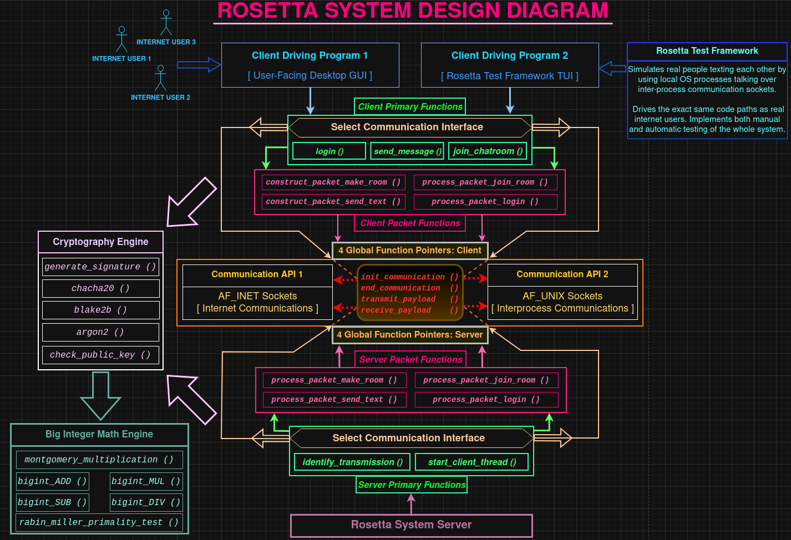

# Rosetta Secret Communications

```
This has been an incredible solo project for me. I started it as an early
intermediate C systems developer on GNU/Linux. Having undertaken it has taught
me colossal amounts in topics spanning from the basics, such as the dangers of
feature creep and the importance of checking for & handling errors in GNU/Linux
syscalls, to the intermediate, such as writing easy-to-maintain Makefiles, to
advanced, such as compiler optimizations & ways a programmer can influence them
positively in source code by (correctly) using compiler hints like __restrict__
and refactors that open up the compiler's eyes when deciding which of its own
optimizations to apply, as well as features of the C language whose purpose
doesn't become apparent until one has written a system that's way beyond trivial
in size, like function pointers. It continues to be a valuable platform where I
can practice advanced systems programming, performance analysis & optimizations.

My stance on LLMs, "AI"-emitted code and "vibe coding":

Rosetta was completed without using "vibe coding" at all. Any use of "AI" to
emit code for use in the project has been kept to a strict minimum and subject
to increased scrutiny and verification. Where LLM chatbots have seen use here is
rather as information dumps, to analyze existing code & to give potential ideas,
in which they have been useful at times. No "vibe coding", however, as I have
concluded firmly that this practice, when over-used to generate code that's then
blindly added to a non-trivial engineering project as long as it appears to work
(it more often than not doesn't) DIMINISHES an engineer's skill in the long run.
I still prefer to come up with and type the vast majority of my code by myself.

In its essence, Rosetta is a system that allows secret communication.

I have implemented the following 5 main components completely from scratch using
only the C language, its standard library, GNU/Linux system calls and standard
GCC compiler features, without external dependencies on libraries or frameworks.

1. Big Integer math engine: From ADD/SUB to Montgomery Multiplication.
2. Cryptography engine: chacha20, blake2b, argon2, Schnorr signatures and more.
3. Multi-interface communication server
4. Multi-interface communication client
5. Rosetta Test Framework, simulating real human users with local OS processes.

In the end, it came out to be roughly 10,000 lines of mostly C code.

The Rosetta server acts as a VPN.

Alice never includes Bob's IP address in her IP header. All clients only send
directly to the Rosetta server's IP address and it relays messages to everyone
else in the chat room without decrypting. ISPs wouldn't know the server machine
is relaying messages. Therefore, your ISP won't even know WHO you are talking
to, in addition to not seeing what you and your friends are saying in the chat.

Rosetta is designed to be highly modular:

The BigInt math & cryptography engines can readily be used for other purposes.

The communication client and server are designed to allow any number of
communication mechanisms to be easily used in the system, as long as said
mechanism implements 4 basic functions - begin communication, send payload,
receive payload and end communication. Such elegance and modularity is possible
thanks to a polymorphic C interface, whose only requirement is that, at system
initialization, 4 function pointers are set to the respective C or C++ functions
that, in turn, implement the 4 respective communication tasks. Currently two
communication interfaces are supported: 1) Internet communication over TCP using
Internet sockets and 2) local OS processes sending each other messages via
Unix Domain sockets, to simulate human users in the Rosetta Test Framework.
A future possible addition here could be radio communication where the client
runs on a custom embedded communicator device.

Lastly on modularity, the client allows for multiple different "client driver"
programs to be written, thus providing different ways to use Rosetta. They
simply need to use the API exposed by the Client Primary Functions collection
found in the header file under the same name and the client driver program can
then wrap these in higher-level user-facing functionality, where by "users" I
mean anything from people texting each other over the internet to a set of
autonomous machines that must automatically deliver messages to each other in
secret. This is how, as mentioned above, radio messaging using a custom embedded
communicator device could be implemented in the future. So far, I have two
client driver programs - a human user-facing C++ wxWidgets GUI that supports the
creation and joining of chat rooms and the second one - the set of manual and
automatic user-spawning programs for whole-system test simulations in the
Rosetta Test Framework.

Wrapping up the introduction, I give an overview of the security scheme that the
Rosetta system uses and implements. When reading it, please note that parameters
like bit size of prime numbers and of cryptography artifacts like salts / nonces
can easily be updated in the future, should security concerns dictate doing so.

--------------------------------------------

Rosetta security scheme overview

It all begins with 2 big prime numbers: 3072-bit M - Diffie-Hellman modulus -
and 320-bit prime Q, where (M-1) is divisible by Q. Rosetta comes with a utility
program to discover such pairs of primes, using the Rabin-Miller primality test
provided by my BigInt math engine.

Once we have M and Q, we compute the Diffie-Hellman generator:
G = [2^(M-1) / Q] mod M

Now the Rosetta server generates its long-term private/public key pair (b,B).
Private key has the same bitwidth as Q and is strictly smaller than Q, while
Public key is taken mod M, so it has the bitwidth of M:
- Private key b = 320 pseudorandom bits taken from /dev/urandom, b < Q.
- Public  key B = G^b mod M
Server’s long-term public key B, its Montgomery form Bm, as well as M, Q, G and
G’s Montgomery form Gm are all available to clients at install time.

Internet connection is NOT needed for a client to create a local savefile. This
is called Registration. The user picks a password. The client software generates
the user’s long-term private/public key pair (a,A) exactly like the server does.
The password is used as a key in Argon2id to produce a 64-byte hash T. The most
significant 32 bytes of hash T are then used as a key in ChaCha20 to encrypt the
user’s private key. ChaCha20 Nonce and Argon2id Salt are stored on the client
machine in the savefile, along with the public key and encrypted private key.

A user must log in before joining a chat room to talk to others in secret. For
this, the user enters their password, it’s analogously used in Argon2id to emit
hash T, the most significant 32 bytes of T  are used in ChaCha20 to decrypt the
user’s private key. A public key is computed from the private key. If it matches
the stored public key in the savefile, it means the password was correct and
login proceeds to connect the Client to the Rosetta server.

The client sends their long-term public key to the server in encrypted form
using a very short-lived ephemeral public/private key pair that was generated by
both the server and the client to produce a short-lived DH shared secret just
for that purpose. Short-lived unidirectional session keys KAB/KBA and a ChaCha
Nonce are extracted from the ephemeral shared secret and used to encrypt/decrypt
communication until the server has the client’s long-term public key. Once the
server securely obtains and decrypts the client long-term public key, the
short-lived key pairs & shared secret are destroyed. HMAC authentication is used
before the server has the client’s long-term public key. Schnorr Signatures
start being used after that for authentication.

When Alice and Bob meet in a chat room, regardless of whether they’ve met before
they always first perform a handshake. The server first sends them the other
side’s public key. They compute a shared secret X and extract unidirectional
session keys KAB and KBA, as well as a chacha Nonce from the shared secret:

1. Alice's client computes a session-length DH shared secret: X = B^a mod M
   Bob's   client computes the same session DH shared secret: X = A^b mod M

2. On Alice's side:
      KAB = least significant 32 bytes of X
      KBA = next 32 bytes of X.

   On Bob's side:
      KBA = least significant 32 bytes of X
      KAB = next 32 bytes of X.

3. On Alice's side, swap KAB with KBA if A < B.
   On Bob's side,   swap KBA with KAB if A > B.

This ensures KAB and KBA end up being the same on both sides.

Whether Alice uses session key KAB to send to Bob and Bob uses KAB to receive
from Alice and then KBA is used in the other direction, OR the other way around,
this is decided by asking “who was in the chat room first?”. Alice and Bob each
have 2 symmetric ChaCha20 Nonce counters, one for Alice sending to Bob and one
for Bob sending to Alice. They are incremented on each usage of ChaCha20 because
re-using the same Nonce and ChaCha key exposes us to potential eavesdroppers.

When Alice decides to send a secret message to Bob, Carol and Fred as they are
all in the same chat room, she generates a pseudorandom one time use key K for
this message. Alice encrypts one-time-use key K with chacha20 and unidirectional
session key KAB/KBA that she has with all other guests (from her Diffie-Hellman
shared secret that she has with everyone). This produces 3 encrypted versions of
the one-time-use key K – KB, KC and KF. Now Alice uses the plaintext version of
one time use key K to encrypt the secret payload itself. Lastly, she generates a
Schnorr Signature on the payload and sends the encrypted message, the encrypted
keys used to decrypt the message (for each person) and her signature.

When the server receives the secret payload, it's unable to decrypt and see it.
Its only purpose is to relay the message to the correct intended receivers. The
server computes its own Schnorr signature, attaches it and relays the message.

So the secret message is hidden behind not one, but two keys.

================================================================================

To compute a Schnorr Signature, the steps are:

1. Use BLAKE2B{64} on input - whatever we're signing. Emits 64-byte prehash PH.

2. Use BLAKE2B{64} on input - the signer's private key concatenated
   with the prehash PH, reduce the result of this modulo (Q-1), add 1.
   This yields the secret k:

k = (BLAKE2B{64}(a||PH) mod (Q-1)) + 1

3. Compute R = G^k mod M
4. Compute e = BLAKE2B{64}(R||PH), truncated to bitwidth of Q.
5. Compute s = ( k + ((Q - a) × e) ) mod Q

As a result, the signature itself is (s,e).

To verify using public key A and whatever was signed with private key a:

1. Check that 0 <= s < Q and that e has the bitwidth of Q.
2. Compute the prehash PH as in step 0 above.
3. Compute R = (G^s * A^e) mod M.
4. Compute val_e = BLAKE2B{64}(R||PH), truncated to bitwidth of Q.
   Check that this is equal to e. If it is, Signature validation passes.
   Under any other circumstances, validation fails.

================================================================================

In the end, when Bob receives Alice’s secret message, he first validates the
server’s signature, so he is assured that the message really was relayed by the
Rosetta server and was not altered en-route. He validates Alice’s own signature,
assuring himself that the message really was sent by her and it wasn’t altered
en-route. He uses the same unidirectional session key KAB/KBA and Nonce
(extracted from his shared secret with Alice) to decrypt the one-time use key K,
then he uses the decrypted key K to actually decrypt the secret message itself.
Carol and Fred do similarly to read the secret message sent to them by Alice.
```
